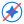

<h1 align="center">
    <br />
    
    <br />
    <b>Do Not Misuse AI</b>
</h1>

<p align="center">
    
    <a href="./LICENSE"></a>
</p>

A manifesto identifying the domains where AI should not be used.

## Development

This site is built with [Zola](https://www.getzola.org/).

### Prerequisites

- [Zola](https://www.getzola.org/documentation/getting-started/installation/) (version 0.22.1 or later)

### Local Build

```sh
zola build
```

Output is written to `public/`.

### Development Server

```sh
zola serve
```

The site will be available at `http://localhost:1111`.

## Project Structure

```
├── content/          # Markdown pages and sections
├── sass/             # SCSS stylesheets
├── static/           # Static assets (JS, images, etc.)
├── templates/        # Zola Jinja2 templates
├── zola.toml         # Site configuration
└── public/           # Build output (gitignored)
```

## Deployment

The site is deployed on Netlify. The build command is `zola build` and the publish directory is `public/`.

## Contributing

Contributions are welcome. Open an issue or pull request on [GitHub](https://github.com/thelicato/donotmisuseai).

## License

This project is released under the [MIT LICENSE](./LICENSE)